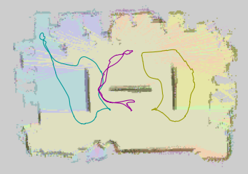
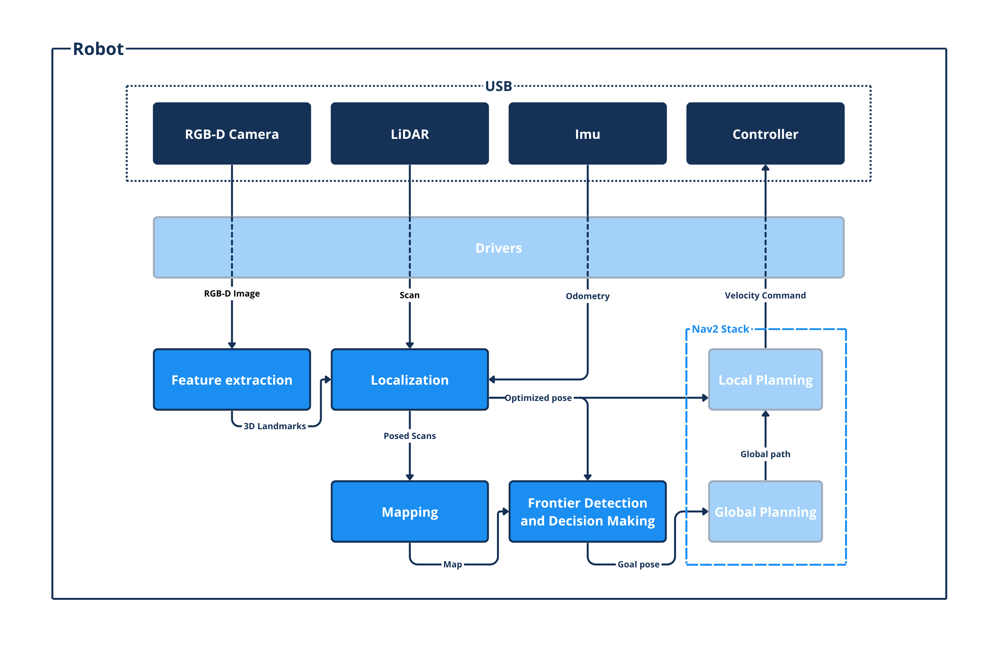
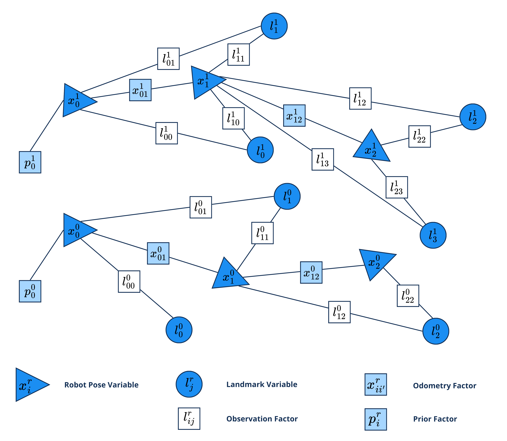
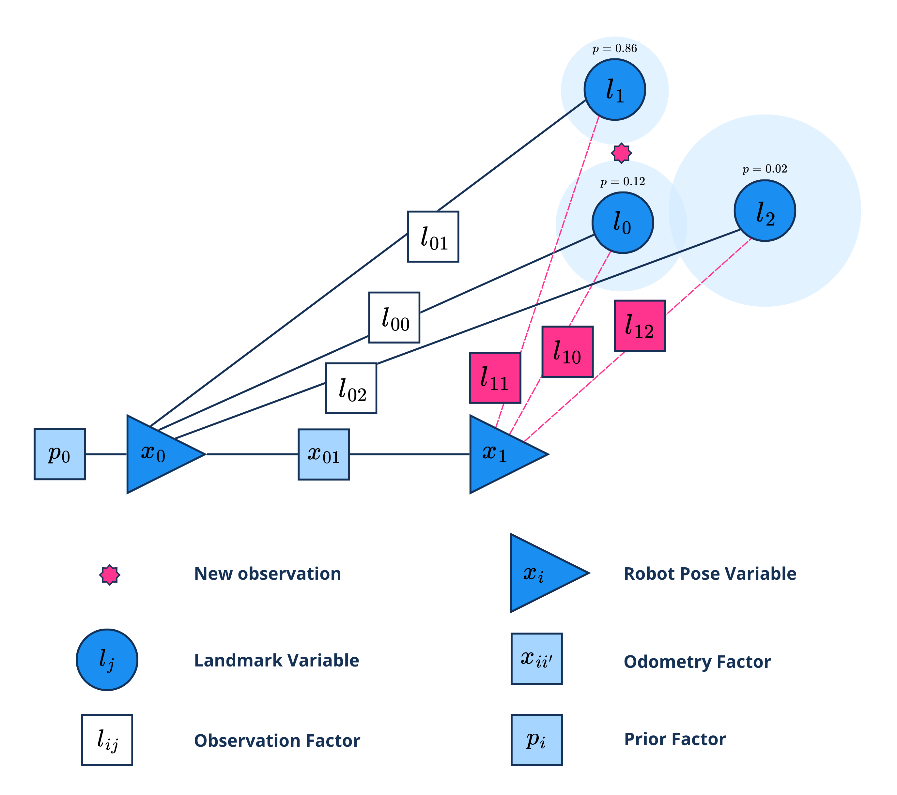
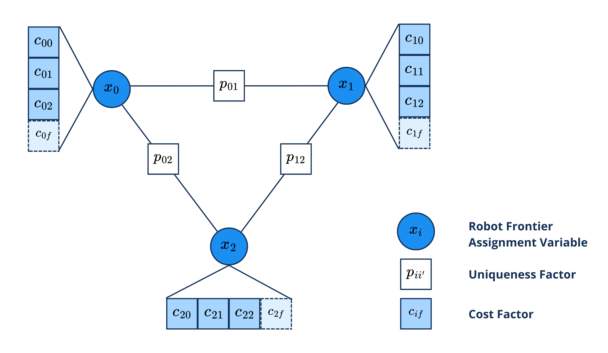
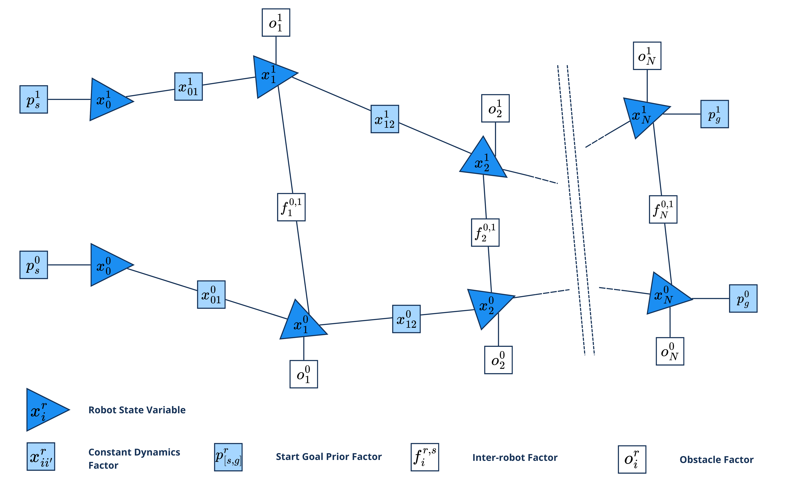
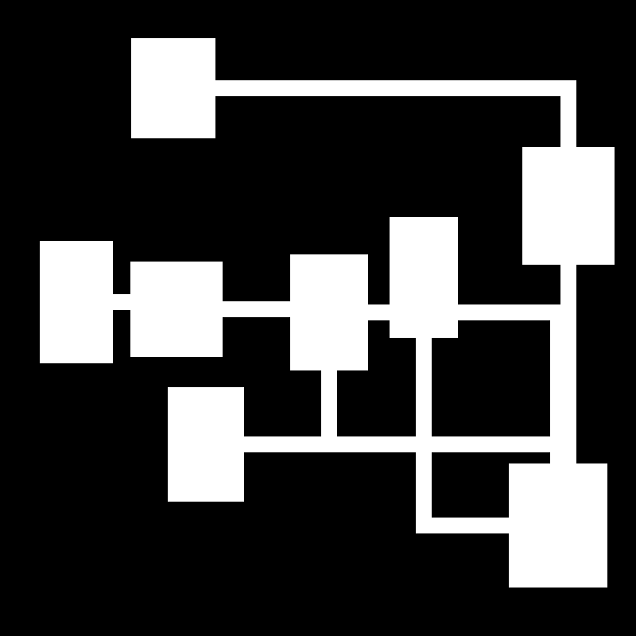
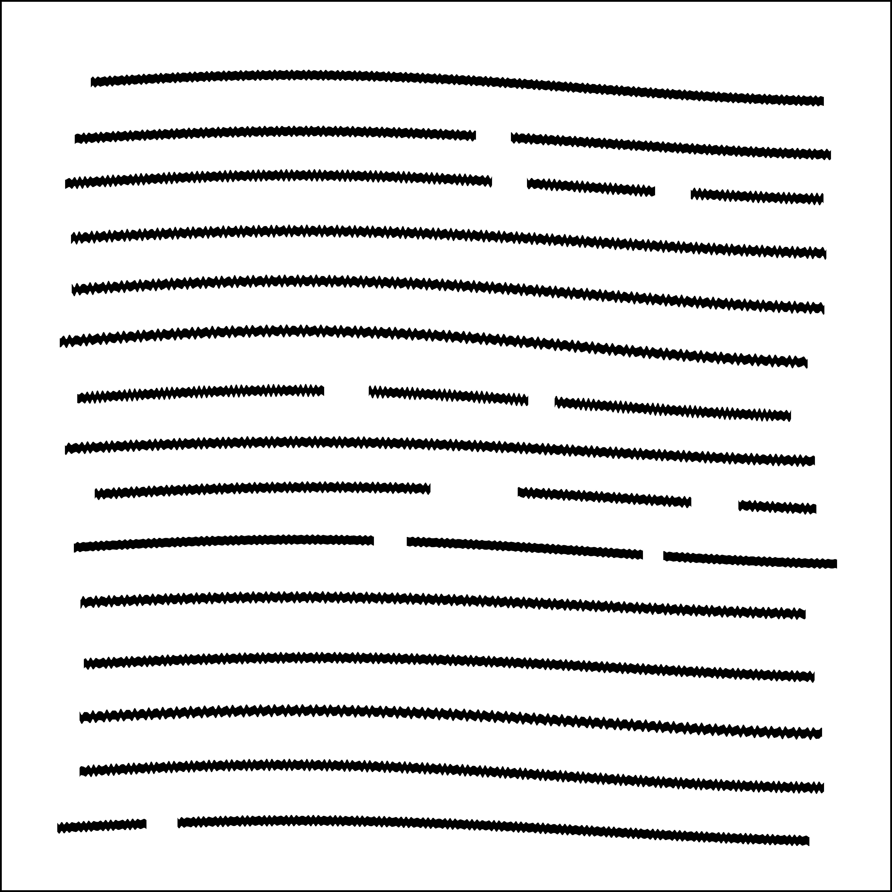

# Multi-robot Collaborative SLAM
Multi-robot collaborative SLAM (Simultaneous Localization and Mapping) centralized framework.
The framework focuses on factor graph solutions, using GTSAM library, for localization, decision-making and local planning problems.

Mapping result using three robots (cyan, magenta and yellow) to map an indoor space:



## Robot setup
The system employes Turtlebot3 robots equipped with onboard inertial measurement system (wheel encoders and IMU) and 2D LidAR and one OAK-D pro RGBD camera.


## Mono-robot architecture


## Multi-robot architecture


## Feature extraction

The feature extraction process uses RGB-D images. Keypoints are detected from RGB images using the ORB (Oriented FAST and Rotated BRIEF) method from OpenCV.
Pinhole projection model is applied to keypoints to integrate depth and extract 3D spatial landmarks.


## SLAM
A GraphSLAM implementation provide the localization of the whole system.

### Localization
Robot poses and landmarks are represented as nodes, with:
- **Prior factors** – initial pose constraints  
- **Odometry factors** – relative motion between poses  
- **Observation factors** – landmark measurements with Huber loss for outlier robustness  

Multi-robot SLAM extends this to a joint graph across all robots.




### Data Association
New visual features are matched to landmarks using **Probabilistic Data Association (PDA)**:
- Computes Mahalanobis distance and likelihood for each candidate landmark  
- Applies soft assignment via normalized probabilities  
- Ensures robust matching under uncertainty and noise  




### Mapping
A **probabilistic occupancy grid** represents the environment:
- Updated incrementally with **posed LiDAR scans**
- Free and occupied cells updated using **log-odds** formulation and **Bresenham’s algorithm**
- Sensor uncertainty modeled with Gaussian smoothing at obstacle boundaries  

A **costmap** is generated from the occupancy grid using an exponential decay from obstacles.


## Frontier detection
**EWFD** (Expanded Wavefront Frontier Detection) detects frontiers (boundaries between known and unknown space) by expanding wavefronts from the robot’s position, only newly discovered free cells are explored.  

EWFD is executed for each robot sharing visited cells information and merging each robot frontiers into a consistent global frontier map.

Detected frontier cells are grouped using **DBSCAN**, which clusters adjacent frontier cells removing isolated noise cells.


## Decision Making
Exploration task allocation across robots is handled through a discrete factor graph formulation, balancing travel cost, information gain, and redundancy:
- **Unary factors** encode individual robot-frontier costs based on distance and frontier size:  
  - Distance cost encourages nearby targets  
  - Size (information gain) rewards informative frontiers  
- **Pairwise factors** penalize robots selecting the same frontier, ensuring unique assignments  

The global optimization seeks the configuration that minimizes total cost:

$$
x^* = \arg \min_{x} \sum_{i} \Big(\alpha d(r_i,x_i)-\beta s(x_i)-\sum_{i{<}j}\psi_{ij}(x_i,x_j)\Big)
$$

where:  
- $d(r_i, x_i)$ — Euclidean distance between robot \(r_i\) and the assigned frontier \(x_i\), representing the travel cost.  
- $s(x_i)$ — size of frontier \(x_i\), quantifying information gain.  
- $\psi_{ij}(x_i, x_j)$ — pairwise uniqueness term that penalizes same frontier assignment.  





## Global Planning
**A\*** algorithm computes optimal paths for each robot on the costmap. Each cell is treated as a graph node, and the algorithm minimizes total traversal cost:

$$
f(n) = g(n) + h(n)
$$

where $g(n)$ is the cost from the start node and $h(n)$ is the heuristic estimate to the goal.  

Edge costs $c(n,n')$ reflect obstacle proximity from an obstacle.

The heuristic is the Euclidean distance to the goal cell.  


## Local Planning
Motion control generating dynamically feasible and collision-free velocity commands.  

### **1. Dynamic Window Approach (DWA)**
A reactive control method that samples and evaluates admissible velocity commands $(v_p, \omega_p)$ within dynamic limits.

- **Admissible velocity space** considers kinematics and acceleration constraints  
- **Trajectory simulation** using differential-drive dynamics  
- **Objective function** balances:
  - $f_{\text{p}}$: progress toward goal  
  - $f_{\text{h}}$: heading alignment  
  - $f_{\text{c}}$: obstacle avoidance  
  - $f_{\text{r}}$: inter-robot repulsion  

The optimal command is:

$$
(v, \omega)^* =\arg \max_{(v, \omega) \in V_{\text{adm}}} J(v, \omega)
$$

where $J(v, \omega)$ is the weighted sum of the score function contributions.

**Limitation:**  
Since DWA assumes constant velocities over a short horizon, it may fail in narrow passages or multi-robot interactions, leading to oscillations or deadlocks.


### **2. Factor Graph-based Local Planner (FGP)**
Formulates local planning as a nonlinear least-squares optimization over a factor graph, representing the trajectories of all robots as discrete states linked by constraints.

Each robot trajectory is discretized into $N$ states over horizon $T_p = N \Delta t$:  

$$
\mathbf{x}_i^r = [x_i^r,\, y_i^r,\, v_{x,i}^r,\, v_{y,i}^r]^T
$$

- **Start prior:** anchors the first state to the robot’s measured position  
- **Dynamics factors:** enforce smooth motion with a constant velocity factor  
- **Obstacle factors:** penalize proximity to obstacles within safety radius  
- **Inter-robot factors:** maintain safe distances between robots  
- **Goal prior:** attracts the terminal state toward a lookahead point along the global path  


After optimization, the first control command is computed as:

$$
v = \frac{\left\|\mathbf{p}_1 - \mathbf{p}_0\right\|}{\Delta t}
\qquad
\omega = \frac{\text{atan2} \big(y_1-y_0,\;x_1-x_0\big)
        - \text{atan2} \big(v_{y,0},\;v_{x,0}\big)}{\Delta t}
$$





## Simulation
The world is represented as an occupancy grid map, where each cell corresponds to a discrete region of the environment.  
Multiple map types are supported through parametric random generators, enabling diverse test conditions:

- **Indoor maps** — corridor and room-based layouts  
- **Vineyard-like maps** — structured row environments  
- **Road network maps** — derived from OpenStreetMap data






Each robot is simulated through multiple threads, emulating both physical dynamics and sensor behavior.  
This structure reproduces real-world asynchronous data streams and noise characteristics.

- **Robot state & IMU thread:**  
  - Updates ground-truth pose using commanded velocities  
  - Integrates kinematics:
  
    $$
    x_{t+1} = x_t + v\cos\theta_t\Delta t,\quad
    y_{t+1} = y_t + v\sin\theta_t\Delta t,\quad
    \theta_{t+1} = \theta_t + \omega\Delta t
    $$

  - Simulates IMU drift and bias via a Gauss–Markov process:  
  
    $$
    b_t = \alpha b_{t-1} + \mathcal{N}(0, \sigma_b^2)
    $$

  - Adds scale errors and noise to measured velocities:
    
    $$
    v_m = (1+\epsilon_v)v + b_v,\; \omega_m = (1+\epsilon_\omega)\omega + b_\omega
    $$

- **LiDAR thread:**  
  - Performs 2D ray tracing in the occupancy grid using the Bresenham algorithm* 
  - Temporarily includes other robots as dynamic obstacles  
  - Adds Gaussian noise to beam range and angle measurements  

- **Camera thread:**  
  - Simulates landmark detection with randomly distributed landmarks in free space  
  - Reports relative landmark positions within range and field of view  
  - Adds Gaussian measurement noise for realism  


## Installation procedure

Docker containers are employed for development and deployment.
In each folder are listed here the docker images:
- Folder: `/dev`
  - Container: `multirobot_slam_dev` 
- Folder: `/monoroobt`
  - Container: `monorobot_slam` 
- Folder: `/multiroobt`
  - Container: `multirobot_slam_server`
  - Container: `multirobot_slam_client`


For each environment some utility scripts are provided to manage docker containers:
- Build docker image:
  
  ```./docker_scripts/docker_build.bash```

- Run docker container (interactive mode):

  ```./docker_scripts/docker_it_run.bash```

- Run docker container :

  ```./docker_scripts/docker_run.bash```

- Attach shell to running docker container :

  ```./docker_scripts/docker_exec.bash```


For each environment some utility scripts are provided to manage ros2 project:
- Build ROS2 project:
  
  ```./scripts/build.bash```

- Launch ROS2 project:
  
  ```./scripts/launch.bash```

- Launch ROS2 project (automatically launched if non-interactive mode):
  
  ```./scripts/launch_auto.bash```

- Launch only Rviz visualization:
  
  ```./scripts/launch_visualization.bash```

- Other useful scripts for each environement...


### Multi-robot setup

This setup involves a server running `multirobot_slam_server` container and multiple Trutlebot3 running `multirobot_slam_client` container.

#### Client configuration
- Build `multirobot_slam_client` container
- Change robot name in `./script/launch.bash` and `./script/launch_auto.bash`
- Move `./systemd_service/multirobot_slam_docker_run.service` in `/etc/systemd/system/multirobot_slam_docker_run.service`
- In `./docker_script/docker_run.bash` set DOCKER_PATH variable set to `<repo>/<environment folder>/<container folder>`
- Enable systemd service:

    `sudo systemctl enable multirobot_slam_docker_run.service`
- Start systemd service:

    `sudo systemctl start multirobot_slam_docker_run.service`
- Check systemd service status:

    `sudo systemctl status multirobot_slam_docker_run.service`

- The service will execute at startup the script `./docker_script/docker_run.bash` running inside the `./script/launch_auto.bash`
