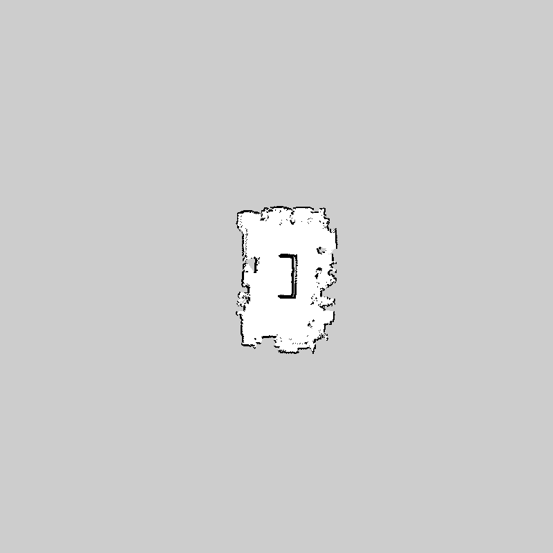
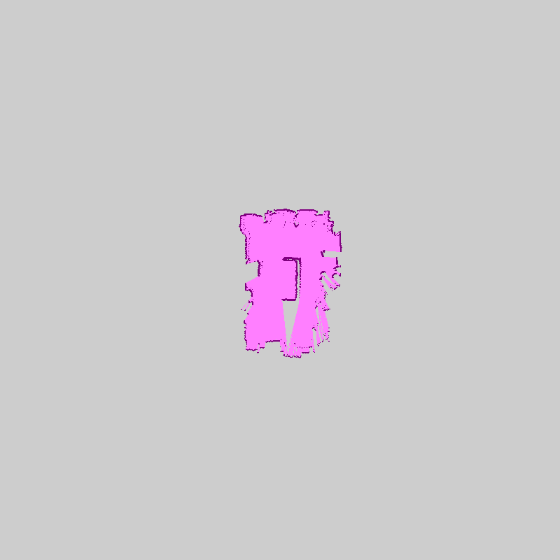
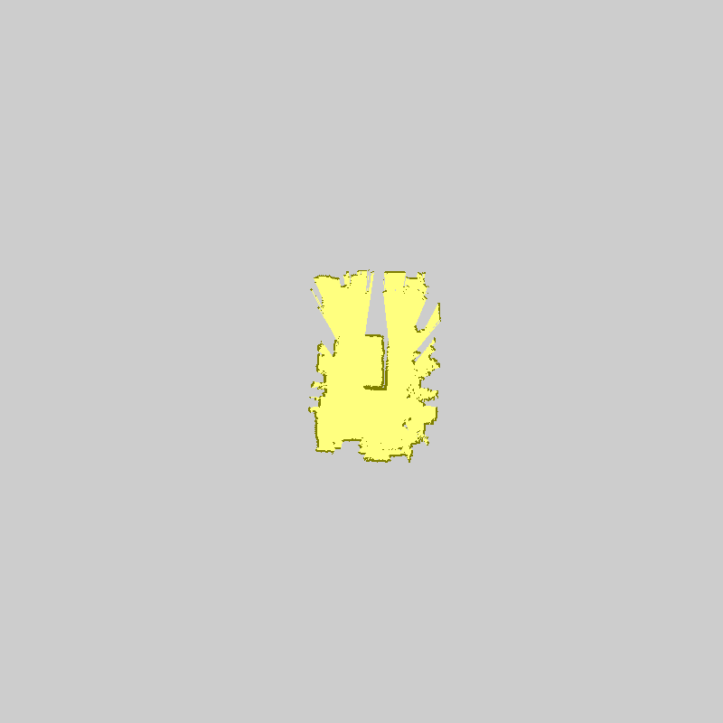
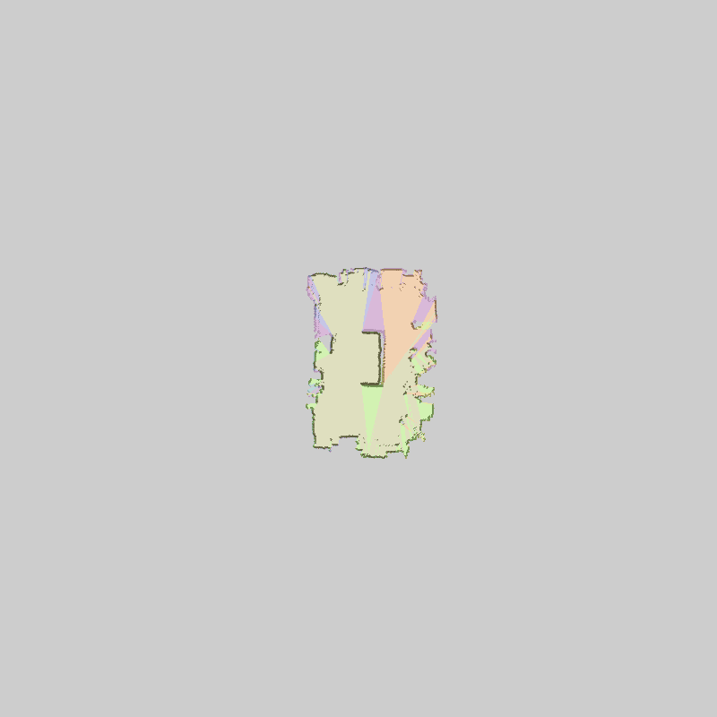

# Evaluation bag_2025_08_28_01_13_22

## Robots:

- robot_0

- robot_1

- robot_2

## Timing evaluation:

### Last velocity commands:

- robot_0: [linear_x=0.000, ang_z=0.000]

- robot_1: [linear_x=0.000, ang_z=0.000]

- robot_2: [linear_x=0.000, ang_z=0.000]

### Success:

- robot_0: True

- robot_1: True

- robot_2: True

### Execution time:

- robot_0: 36134 ms

- robot_1: 36134 ms

- robot_2: 39208 ms

Total: 39208 ms

Bag record time: 44822 ms

## Mapping evaluation:

### Mapping metadata:

Map resolution: 0.050

Map width: 800

Map height: 800

Map origin: (-20.0, -20.0, 0.0)

### Mapping results:

Map:

Map robot_0:

Map robot_1:

Map robot_2:

Map merged:

